## 建置Openssl 動/靜態函式庫 並實現函式調用
---
# 1. 下載 strawberry-perl-5.30.2.1-64bit, nasm installer-64.exe, openssl 和 visual studio
a. strawberry-perl: http://strawberryperl.com/

b. nasm installer-64: https://www.nasm.us/pub/nasm/releasebuilds/2.14.02/win64/ (下載安裝完，把NASM資料夾加入環境變數)

c. openssl: https://github.com/openssl/openssl\ (下載完解壓縮)

d. visual studio: https://visualstudio.microsoft.com/zh-hant/?rr=https%3A%2F%2Fwww.google.com%2F
# 2. 打開 x64 Native Tools Command Prompt for VS 2019
        cd 到所下載 openssl-master 目錄
        輸入以下指令確認正確安裝與版本:
        perl --version
        nasm --version
        nmake /?

新建一個新資料夾(暫時存放編譯過程中間資料和編譯檔)，空資料夾創建結構如圖(以cmd "tree" 表示)
(p.s. 這裡不知道為啥我電腦cmd tree畫出來擋到資料夾名稱)

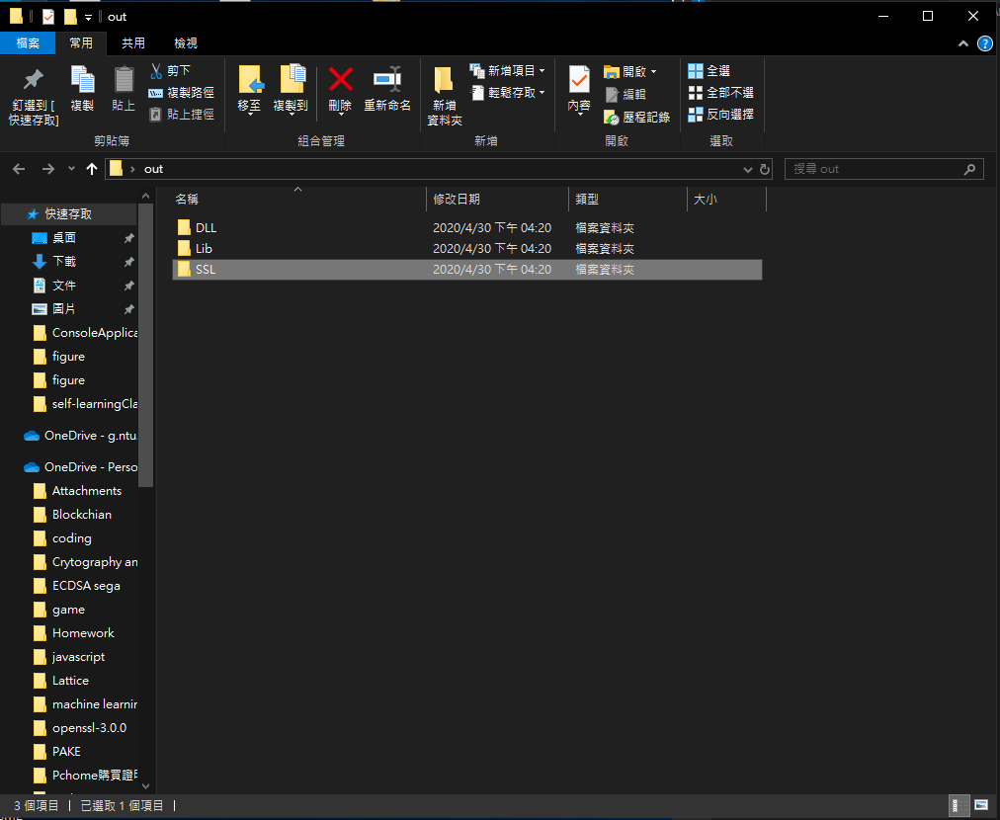
---
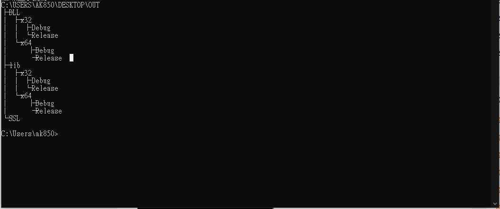

# 3. 回到cmd 依序執行以下指令 (先 bulid DLL x64 release)
     cpan -i Text::Template
     cpan -i Test::More
     perl Configure VC-WIN64A --prefix=C:\Users\ak850\Desktop\out\DLL\x64\Release  --openssldir=C:\Users\ak850\Desktop\out\SSL
     nmake
     nmake test
     nmake install_sw
(Note: prefix 和 openssldir 路徑依照個人創建資料夾位置進行調整)

# 4. Bulid Lib x64 release
     nmake clean
     perl Configure VC-WIN64A --prefix=C:\Users\ak850\Desktop\out\Lib\x64\Release  --openssldir=C:\Users\ak850\Desktop\out\SSL no-shared
     nmake
     nmake test
     nmake install_sw
(Note: 第二行指令記得指向 Lib 最後加上 no-shared)

# 5.用批次擋進行 debug x64 安裝
到所解壓縮openssl-master資料夾下，創建新txt更改名子與副檔名為 x64bulid.bat，用文字編輯器打開編輯(這裡我使用visual studio code)，複製貼上以下文字。

    nmake clean
    perl Configure VC-WIN64A --debug --prefix=E:\openssl-master\out\DLL\x64\Debug --openssldir=E:\openssl-master\out\SSL
    nmake test
    nmake install_sw

    nmake clean
    perl Configure VC-WIN64A --debug --prefix=E:\openssl-master\out\Lib\x64\Debug --openssldir=E:\openssl-master\out\SSL no-shared
    nmake test
    nmake install_sw

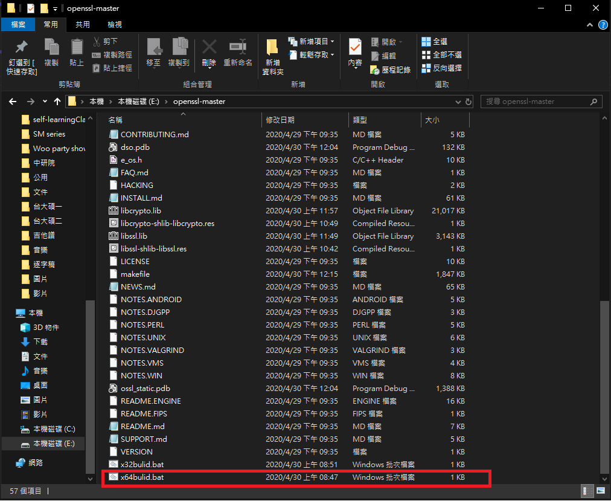

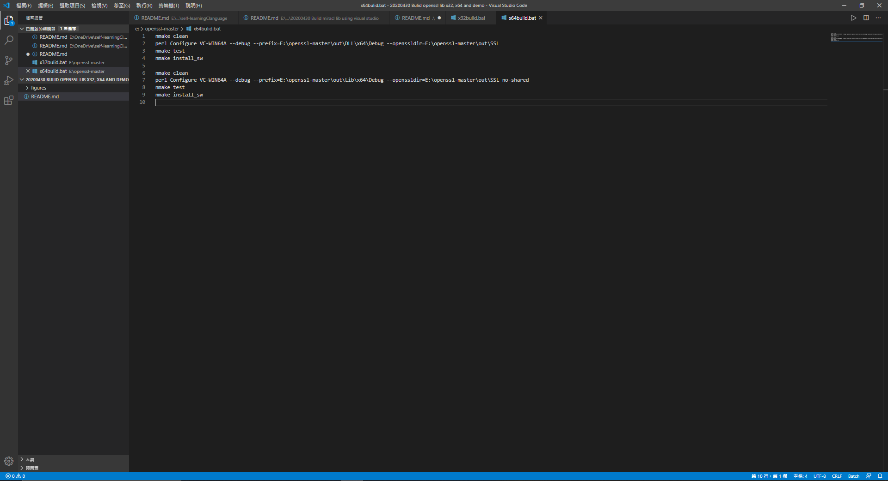

# 6.回到cmd輸入
    x64bulid.bat

# 7用批次擋一次進行 x32 DLL, Lib release 版 和 debug 版 安裝

打開 x86 Native Tools Command Prompt for VS 2019

        cd 到所下載 openssl-master 目錄

到所解壓縮openssl-master資料夾下，創建新txt更改名子與副檔名為 x32bulid.bat，用文字編輯器打開編輯(這裡我使用visual studio code)，複製貼上以下文字。

    nmake clean
    perl Configure VC-WIN32 --debug --prefix=E:\openssl-master\out\DLL\x32\Debug --openssldir=E:\openssl-master\out\SSL
    nmake test
    nmake install_sw

    nmake clean
    perl Configure VC-WIN32  --prefix=E:\openssl-master\out\DLL\x32\Release --openssldir=E:\openssl-master\out\SSL
    nmake test
    nmake install_sw

    nmake clean
    perl Configure VC-WIN32 --debug --prefix=E:\openssl-master\out\Lib\x32\Debug --openssldir=E:\openssl-master\out\SSL no-shared
    nmake test
    nmake install_sw

    nmake clean
    perl Configure VC-WIN32  --prefix=E:\openssl-master\out\Lib\x32\Release --openssldir=E:\openssl-master\out\SSL no-shared
    nmake test
    nmake install_sw
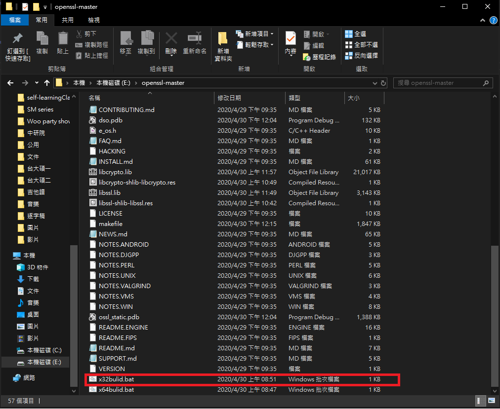

# 8.回到cmd輸入
    x32bulid.bat
(Note: x86 Native Tools Command Prompt for VS 2019 下輸入指令)

# 9.建立新資料夾存放建置的函式庫(依個人習慣命名)

delete 剛剛SSL資料夾 (此資料夾為空，剛剛拿來暫存資料)\
更改 DLL資料夾名稱為 SHARED (依個人習慣命名)\
更改 Lib資料夾名稱為 STATIC (依個人習慣命名)

# Example 1.打開visual studio測試，以下測試調用SHA256函數 (此測試為調用靜態函式庫)

開啟一個新console專案，來源檔案貼入以下程式碼。

    #include <iostream>
    #include <iomanip>
    #include <sstream>
    #include <string>

    using namespace std;

    #include <openssl/sha.h>
    string sha256(const string str)
    {
        unsigned char hash[SHA256_DIGEST_LENGTH];
        SHA256_CTX sha256;
        SHA256_Init(&sha256);
        SHA256_Update(&sha256, str.c_str(), str.size());
        SHA256_Final(hash, &sha256);
        stringstream ss;
        for (int i = 0; i < SHA256_DIGEST_LENGTH; i++)
        {
            ss << hex << setw(2) << setfill('0') << (int)hash[i];
        }
        return ss.str();
    }

    int main() {
        cout << sha256("1234567890_1") << endl;
        cout << sha256("1234567890_2") << endl;
        cout << sha256("1234567890_3") << endl;
        cout << sha256("1234567890_4") << endl;
        return 0;
    }
此時注意方案組態和方案平台。

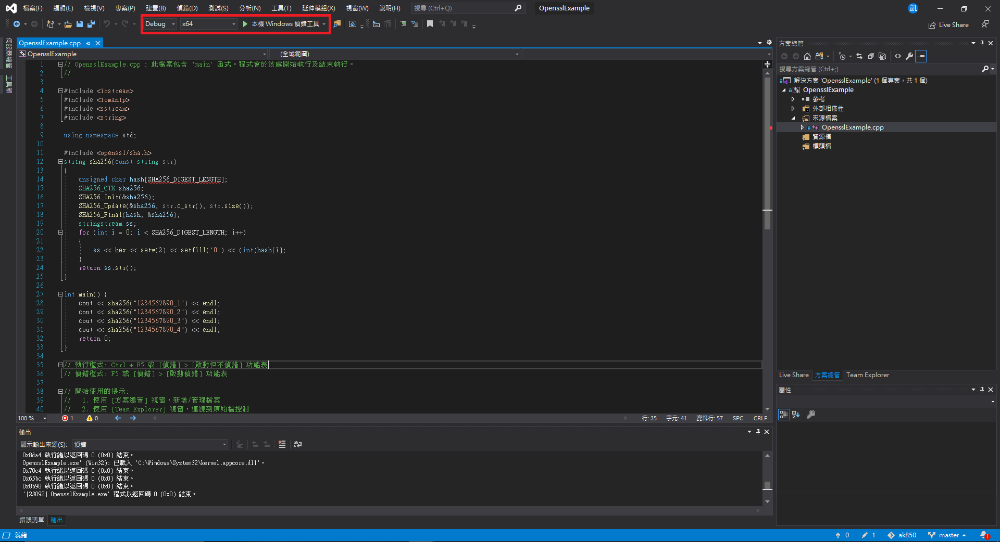

請至專案->屬性->C/C++->一般->其它include目錄加入剛剛 STATIC資料夾下的include資料夾 (如圖所示)。

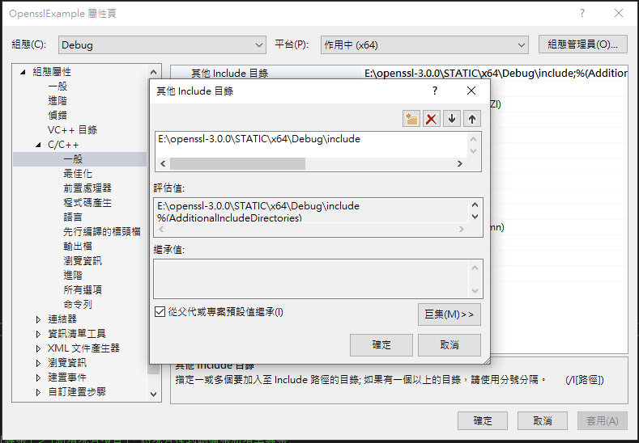

請至專案->屬性->linker->輸入->其它相依性 加入剛剛 x64\Debug\lib\libcrypto.lib 和 x64\Debug\lib\libssl.lib (如圖所示)。

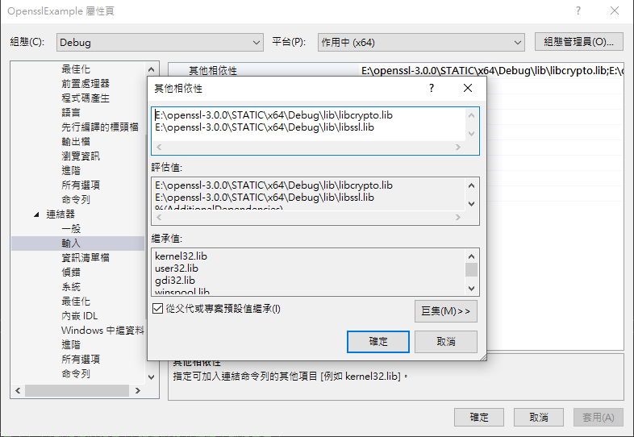

運行並出現以下畫面。

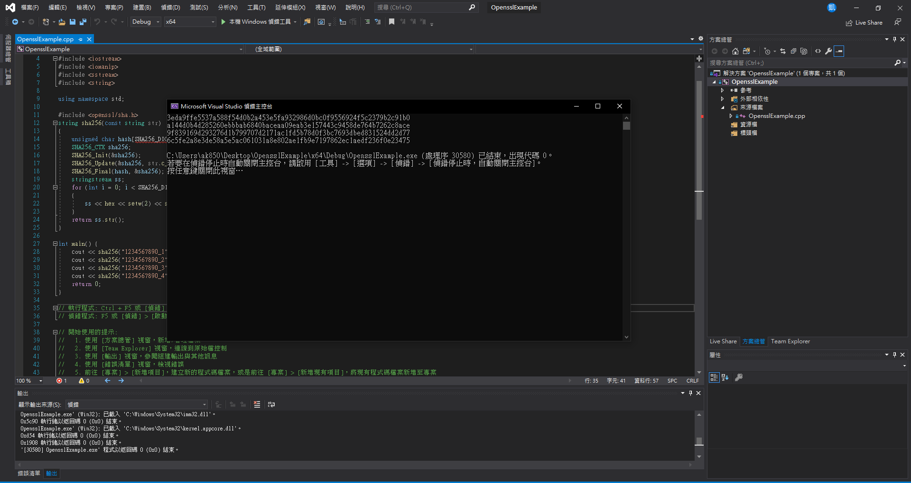

# Example 2.打開visual studio測試，以下測試調用SM2函數 (此測試為調用動態函式庫)
請至連結下載測試帶碼: https://github.com/greendow/SM2-signature-creation-and-verification

依圖的右邊所示，加入相應檔案。

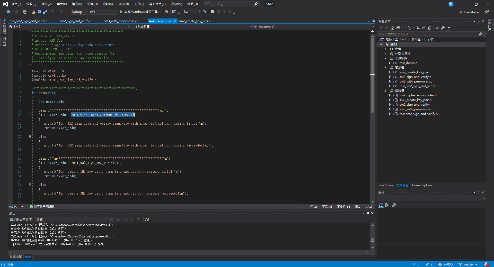

此時注意方案組態和方案平台，做相應調整。

請至專案->屬性->C/C++->一般->其它include目錄加入剛剛 SHARED資料夾下的include資料夾 (如圖所示)。

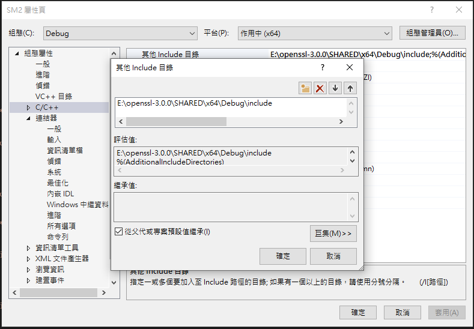

請至專案->屬性->linker->輸入->其它相依性 加入剛剛 SHARED\x64\Debug\lib\libcrypto.lib 和 SHARED\x64\Debug\lib\libssl.lib (如圖所示)

(若VS 抓不到 libcrypto-3.dll (檔案位於 SHARED\x64\Debug\bin)，請手動添加到同一個專案資料夾，如圖。)

運行並出現以下畫面。
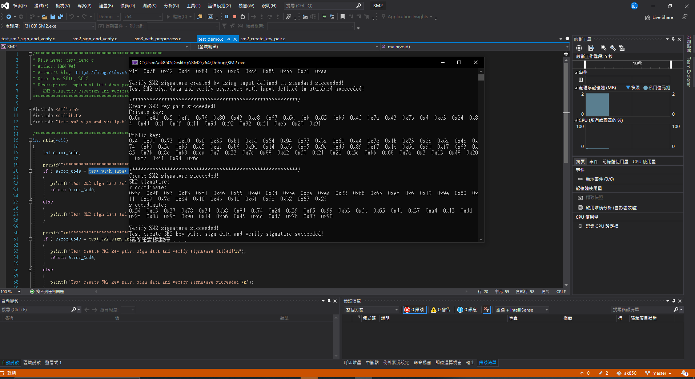