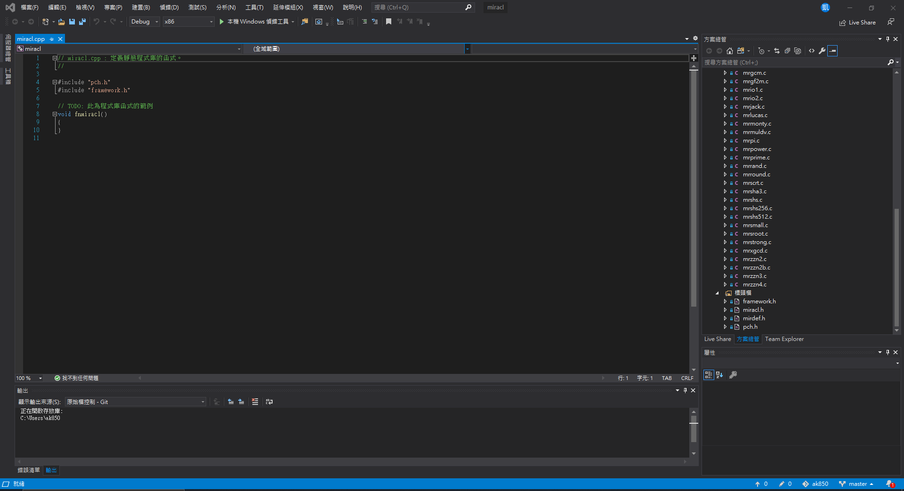
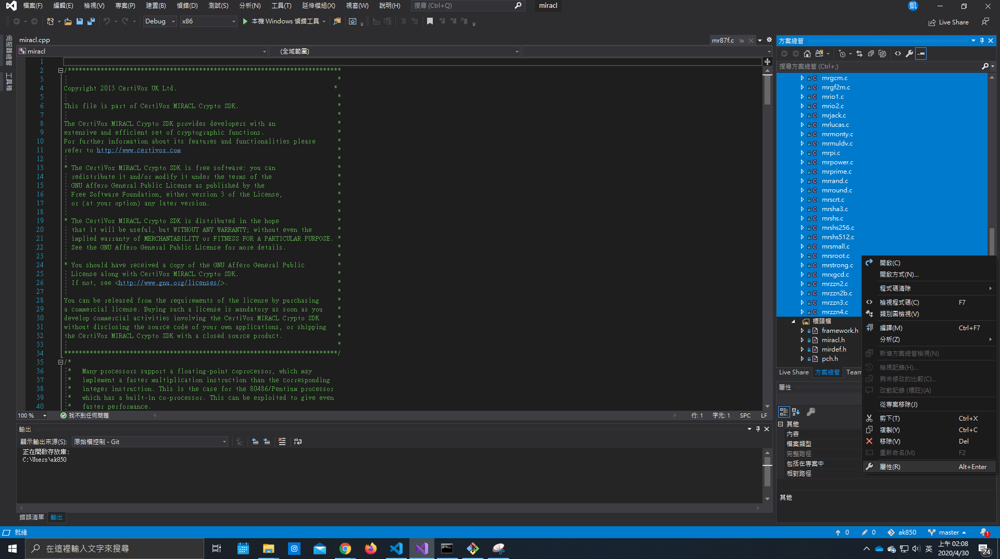
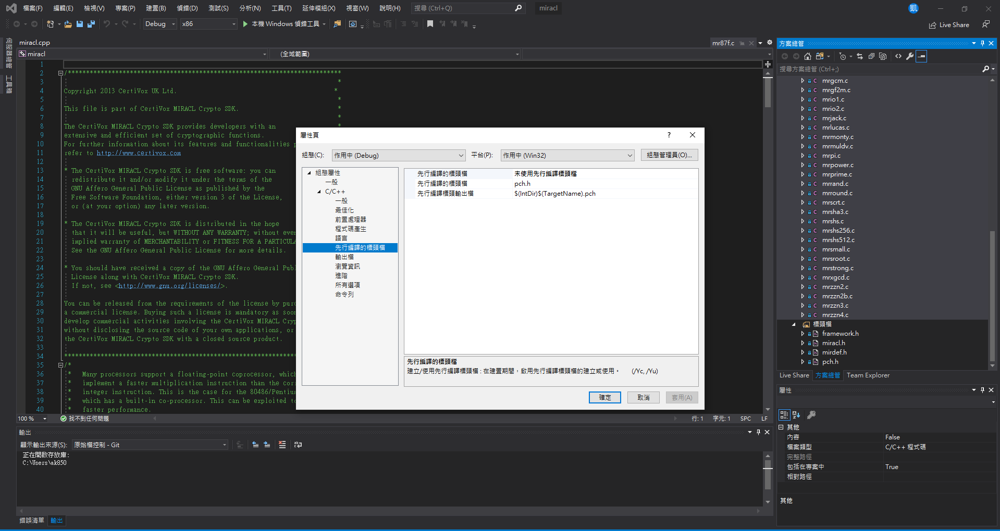
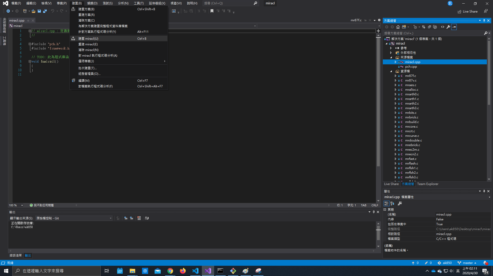
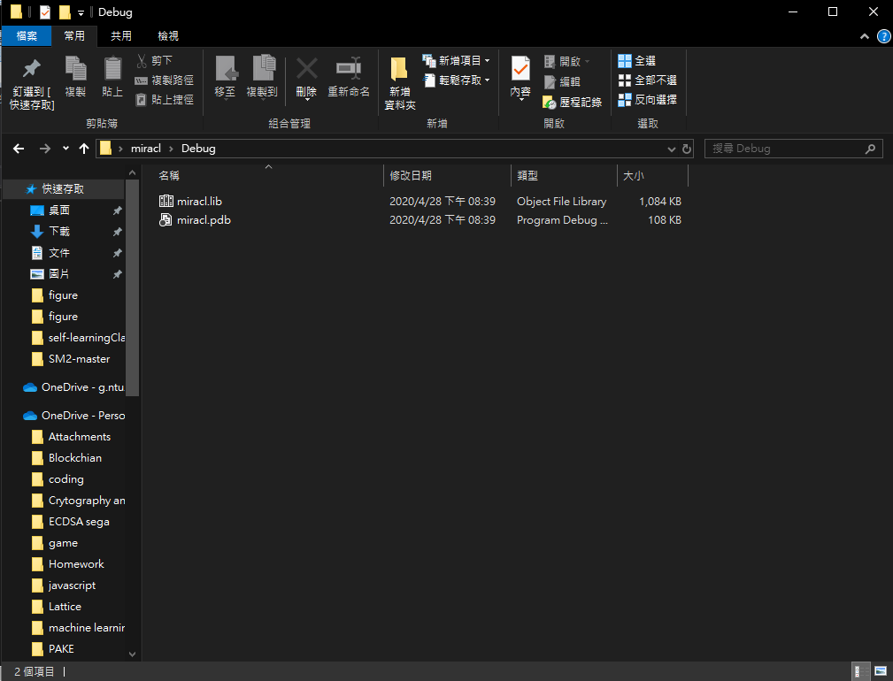
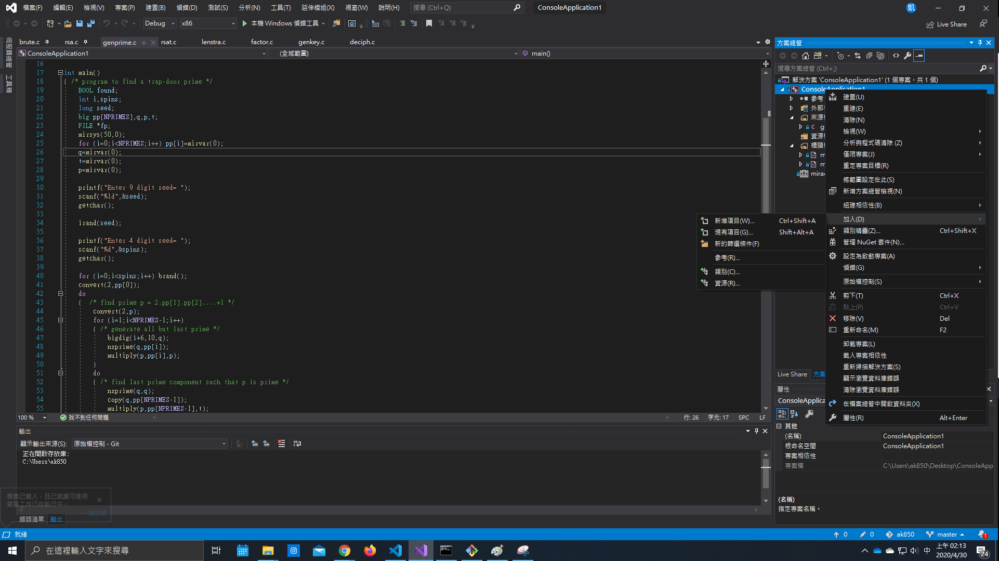
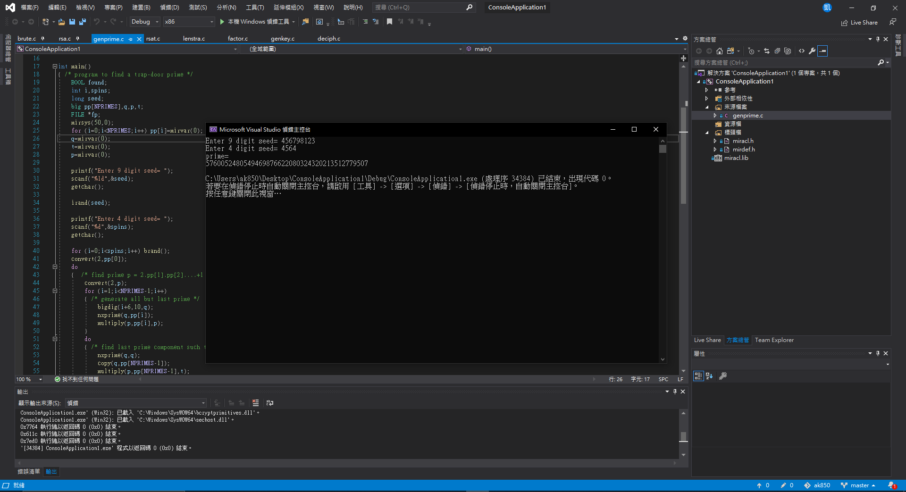
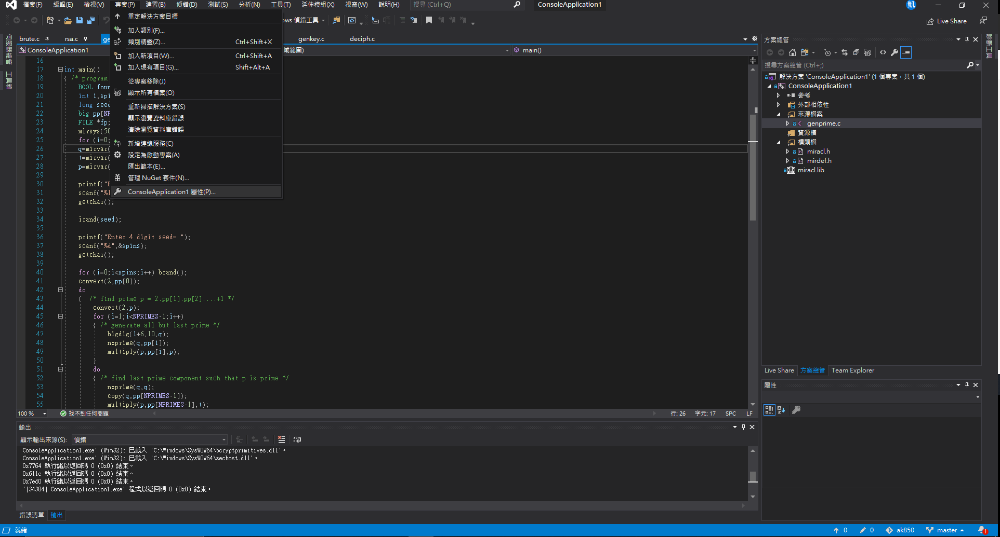
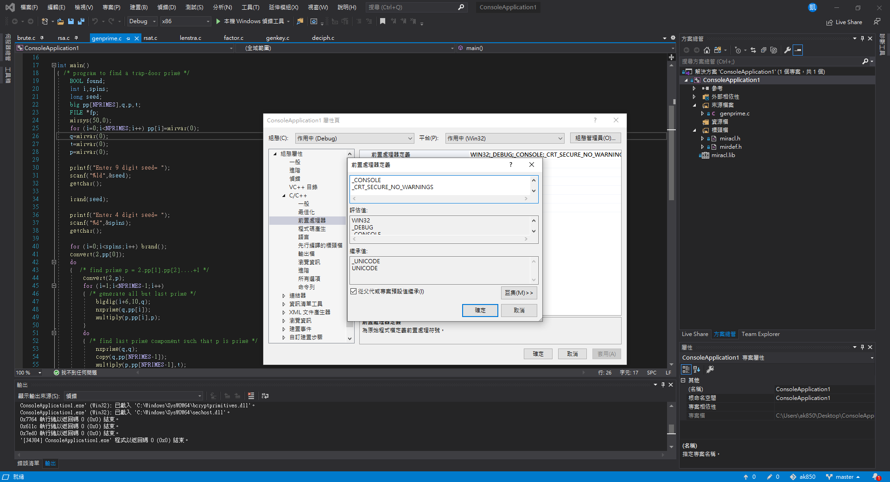

## Bulid Miracl lib Flies
---
# 1. 下載 miracl 碼源 或 以上資料夾

https://github.com/miracl/MIRACL

---

# 2 開啟visual studio 並建立靜態程式庫專案
     標頭檔->加入->現有項目->miracl.h, mirdef.h

     資源檔->加入->現有項目->所有mr開頭的.c檔

     資源檔和來源檔案->屬性->C/C++->先行編譯標頭檔->未使用先行編譯標頭檔

     Build 專案產生lib檔案 (maybe會報錯 但先不處理)

---

---

---

---

---  
     
# 3 開啟visual studio 並建立新的console專案並測試
    標頭檔->加入->現有項目->miracl.h, mirdef.h
    
    專案->加入->現有項目->剛剛產生的lib檔案
    
    來源檔案->加入->現有項目->genprime.c做測試 (並刪除原本console.cpp 避免重覆定義)
    (另有多加測試 brent.c (brent algoirhtm), brute.c)

    Bulid 

    若有產生 "This function or variable may be unsafe. 
    Consider using XXX_s instead. To disable deprecation, use _CRT_SECURE_NO_WARNINGS." 問題
    專案->屬性->C/C++->前置處理器->前置處理器定義第一欄 增加 _CRT_SECURE_NO_WARNINGS

---

---

---

